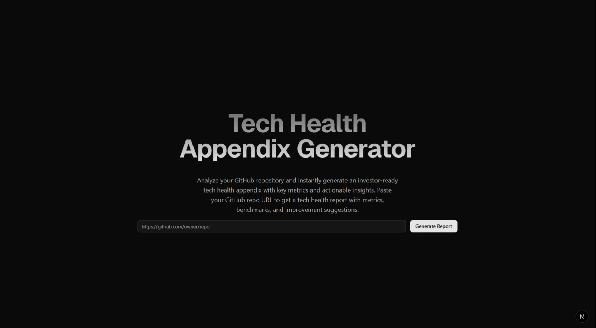

# Tech Health Appendix Generator





## How to run

- Install deps

```shell
npm install

#yarn
```

- Create a .env file with your Github token
```shell
GITHUB_TOKEN="Your Token"

#Dont forget the other keys for any model that you choose
```
- Configure your LLM in `src/lib/llm/ts` a Anthropic one is already configured

- Run the dev script with your package manager `npm run dev` `yarn dev`

## 📌 Overview

Generates a technical appendix with code analysis and metrics, ideal for pitching early-stage startups. It uses Langchain behind the scene to orchestrate the model invocation and a public Github API to generate data to prompt the models.

## ⚙️ Tecnologias utilizadas

- Nextjs, tailwind and shadcn for frontend (Due to rapid prototyping and code consistency)
- Axios for API calls (More verbose and opinionated than fetchter)
- Langchain for Model calls (Pretty much the standard for model orchestration and would give me the flexibility to choose which model of which integration to use.)

## 🧠 How i used AI

Generate a base data from Github API and use that data to compose a prompt engineering and invoke that using langchain, besides that i use a deepseek along the development to improove performance on types and util libs.

## How your solution addresses the core problem

Basically the system use a repo name to gather some metadatas from that and send to a model create a technical appendix that has a strong tendency to be textual and audits a codebase to build investor confidence.

## ⏱️ Total time of code

### 4h15min

About 1 hour to config all boilerplate from next tailwind and shadcn components, 2 hours of code componentes, api calls to github and types, about 1 hour to integrate langchain and some tests.

## 🛣️ Roadmap

A litle roadmap for a second iteration of MVP

| Improvement           | Time required |
|----------------|---------------|
| Implement tanstack react query | 2 hours  |
| A history of already checked repos   | 3 hours  |
| refactor and modularize stores for global state, using zustand  | 1 hour  |
| Improve typing   | 2 hours  |
| Fine tuning of prompt or RAG   | 5 hours  | 
